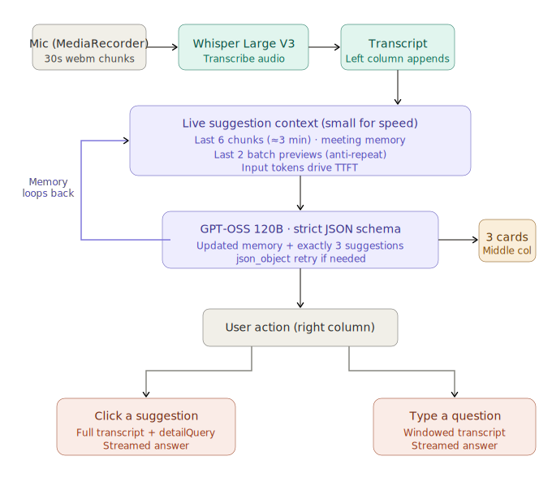

# TwinMind Live Suggestions

**Live app:** https://twinmind-assignment-three.vercel.app
**Repo:** https://github.com/yashaswinidinesh/twinmind-assignment

---

## What it does

Three-column layout matching the reference mockup. Mic and transcript on the left, three live suggestion cards in the middle refreshing every 30 seconds, chat on the right. Click a card and a detailed answer streams in. Type a question directly and get the same. Export the full session as JSON at any time.

Transcription via Whisper Large V3. Suggestions and chat via GPT-OSS 120B. Both through Groq. Paste your own API key in Settings.

---

## Architecture



Audio chunks hit Whisper every 30 seconds. The transcript feeds into GPT-OSS 120B along with rolling meeting memory and the last two suggestion batches for anti-repetition. The model returns exactly three suggestions and updates the memory, which loops back into the next call. Clicked suggestions use the full transcript. Typed questions use a bounded context window.

---

## Running it locally

Node 20.9+ and a Groq API key from console.groq.com.

```
git clone https://github.com/yashaswinidinesh/twinmind-assignment
cd twinmind-app
npm install
npm run dev
```

Open localhost:3000, paste key in Settings, click the mic.

---

## What I focused on

The brief says the evaluation is mostly about showing the right suggestion at the right time, and explicitly discourages UI exploration. So the layout follows the prototype and the time went into the suggestion engine.

**Rolling meeting memory.** The context sent every 30 seconds is intentionally small — Groq's latency docs say input tokens drive time-to-first-token. Instead of shipping the full transcript, the model maintains a structured summary (active topic, open questions, decisions, claims to verify) that carries forward into each call. A suggestion at minute 10 still knows what was decided at minute 2.

**Anti-repetition.** Previews from the last two batches feed into the next call with an explicit instruction not to restate them unless the conversation materially shifted. Without this, a live assistant tends to repeat the same points every 30 seconds in slightly different wording — which is the fastest way it feels broken.

**Two-layer suggestion shape.** Each card has a short visible preview and a hidden `detailQuery`. The preview is what you read on the card. The `detailQuery` is the richer, more specific prompt that runs when you click. This lets the card stay scannable while the clicked answer is genuinely more useful than just an expansion of the preview text.

---

## Prompt strategy

**Live path (auto every 30s):** last 6 transcript chunks, current meeting memory, last 2 batch previews. Nothing else. Kept small for latency.

**Click path:** full transcript plus meeting memory plus the hidden `detailQuery`. User committed to reading — quality matters more than shaving 200ms.

**Typed questions:** bounded window, 12 chunks by default, editable in Settings.

Strict JSON schema output on the suggestions route with a `json_object` fallback if schema mode returns an error.

---

## Engineering decisions

**Stop-and-restart MediaRecorder instead of timeslice.** With `recorder.start(timeslice)`, only the first chunk has a valid container header. Every subsequent chunk is a headerless fragment Whisper cannot decode as a standalone file. Restarting the recorder at each interval means every chunk is a complete, self-contained audio file. This was the root cause of transcript chunks silently disappearing and took the most time to track down.

**Client-side hallucination filter.** Whisper invents short filler phrases during silence ("Thank you", "Thanks for watching", "Okay") because it was trained heavily on YouTube audio. A small exact-match denylist in `lib/utils.ts` drops these before they hit the transcript. Only catches chunks where every sentence is a known hallucination phrase.

**Retry on transcription format errors.** When the browser and Groq disagree on codec, the server retries once with an alternate file extension before falling back to empty text. Safari in particular produces MP4 audio while reporting a WebM MIME type.

---

## Settings

Editable at runtime in the drawer:

- Groq API key (sessionStorage, current tab only)
- Language hint for Whisper
- Auto-refresh cadence
- Live suggestion context window (chunks)
- Chat/expansion context window (chunks)
- Temperature for both paths
- All three prompts — live suggestions, click expansion, free-form chat

One-click reset to defaults.

---

## Export

JSON file with: full transcript, every suggestion batch with meeting memory snapshot and latency at that moment, full chat history with first-token timings, all memory snapshots, and a telemetry block. API key excluded.

---

## Things I would improve with more time

1. Build an eval harness — run recorded meetings through the suggestions endpoint and score output against a rubric. Current prompt defaults are based on judgment, not measurement.
2. Downsample audio client-side to 16kHz mono WAV before sending to Whisper. Groq's docs say that's the lowest-latency path.
3. Voice-activity detection to break chunks at silences rather than hard 30-second cuts.

---

## Stack

Next.js 16, React 19, TypeScript 5.6. Three API routes under `app/api/`. Plain CSS. One runtime dependency: `next`.

---

## File map

```
app/page.tsx              Session state, mic lifecycle, all UI
app/api/transcribe/       Whisper Large V3, format retry
app/api/suggestions/      GPT-OSS 120B, strict JSON schema + fallback
app/api/chat/             Streaming SSE, expansion and free-form modes
components/SettingsDrawer.tsx  Editable prompts, settings, reset
lib/defaults.ts           Prompts and defaults — start here
lib/types.ts              Shared client/server contract
lib/schema.ts             Strict JSON output schema
lib/utils.ts              fetchWithTimeout, hallucination filter, error messages
docs/architecture.svg     Data flow diagram
```

---

## On using TwinMind

Used the live suggestions feature before starting. Two things I noticed: suggestions during quiet stretches still feel generic when staying silent would be better, and when the conversation pivots topics the prior context takes a few cycles to fade. The rolling memory and anti-repetition here are a direct attempt at the second one.
